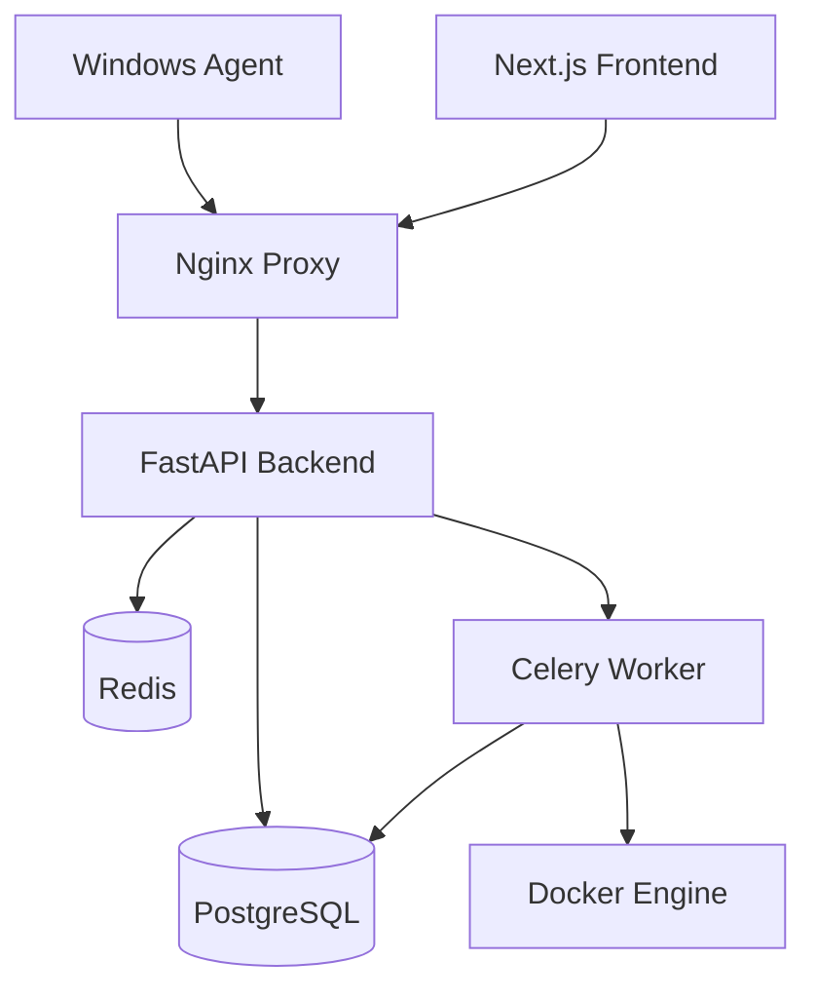

# JudgeLab

[](https://github.com/judgelab/judgelab/actions)
[](https://opensource.org/licenses/Apache-2.0)
[](docs/SECURITY.md)

> A production-quality online judge platform with advanced security features and lockdown exam browser

JudgeLab combines a competitive programming platform with enterprise-grade security, featuring a Windows lockdown agent for secure assessments, comprehensive judging system, and gamification elements.

## ✅ Project Status

**CI/CD Pipeline**: ✅ Tests passing after configuration fixes  
**Security Scans**: ✅ TruffleHog secret scanning configured  
**Code Quality**: ✅ Jest, ESLint, and Python linting enabled  
**Test Coverage**: ✅ Frontend tests configured with proper module mapping  

### Recent Fixes
- Fixed Jest configuration (`moduleNameMapping` → `moduleNameMapper`)
- Updated TruffleHog secret scanning with proper commit range detection
- Resolved CI/CD pipeline failures in GitHub Actions

## 🚀 Features

### 🛡️ Security-First Design
- **Lockdown Agent**: Windows app with WebView2 that blocks copy/paste, screenshots, and detects AI tools
- **Integrity Monitoring**: Real-time detection of multiple displays, unauthorized processes, and violations
- **Sandboxed Execution**: Docker-isolated judge workers with resource limits and security profiles
- **Network Isolation**: Judge containers run with `--network none` for maximum security

### 🏆 Online Judge Platform  
- **Multi-Language Support**: Python, C++, Java, JavaScript, Go, Rust
- **Advanced Judging**: Custom checkers, time/memory limits, detailed test results
- **Problem Authoring**: Rich markdown editor, test case management, availability windows
- **Timed Assessments**: Configurable solve limits, attempt tracking, late submission handling

### 🎮 Gamification
- **XP & Levels**: Earn points for solving problems, with difficulty multipliers
- **Badges & Achievements**: First AC, speed solves, streaks, clutch completions
- **Leaderboards**: Real-time rankings with seasonal competitions
- **Progress Tracking**: Solve streaks, fastest times, problem statistics

### ⚙️ Enterprise Ready
- **Scalable Architecture**: Microservices with Docker Compose orchestration
- **Database Migrations**: Alembic-managed schema with seed data
- **CI/CD Pipeline**: GitHub Actions with security scanning and multi-stage deployment
- **Monitoring**: Structured logging, health checks, and integrity audit trails

## 🏃‍♂️ Quick Start

### Prerequisites
- **For full setup**: Docker & Docker Compose
- **For local development**: Node.js 18+, Python 3.12+ 
- **For Windows agent**: .NET 8.0
- **Optional**: PostgreSQL and Redis (if not using Docker)

### 🚀 One-Click Local Setup

**Windows:**
```cmd
start-local.bat
```

**Linux/Mac:**
```bash
./start-local.sh
```

These scripts will:
1. Install all dependencies automatically
2. Set up environment files from examples
3. Give you options for different startup modes
4. Handle the complexity for you!

### Manual Setup Options

#### Option 1: Full Docker Setup (Recommended)
```bash
# Clone and start everything with Docker
git clone https://github.com/judgelab/judgelab.git
cd judgelab
docker-compose up --build
```

#### Option 2: Local Development (No Docker)
```bash
# 1. Install dependencies
npm run setup:local

# 2. Set up environment variables (or use start-local script)
cp apps/web/.env.example apps/web/.env.local
cp apps/api/.env.example apps/api/.env

# 3. Start services individually
npm run dev:web    # Frontend at http://localhost:3000
npm run dev:api    # Backend at http://localhost:8000
npm run dev:worker # Background worker
```

#### Option 3: Hybrid Setup
```bash
# Use Docker for databases only
docker-compose up postgres redis -d

# Run application services locally  
npm run dev:web
npm run dev:api
npm run dev:worker
```

### Access the Platform

**Full Docker Setup:**
- **Web Interface**: http://localhost
- **API Documentation**: http://localhost/api/v1/docs
- **Admin Panel**: Login with `admin@judgelab.dev` / `admin123`

**Local Development:**
- **Web Interface**: http://localhost:3000
- **API Documentation**: http://localhost:8000/docs
- **Direct API**: http://localhost:8000/api/v1/

### Default Accounts

| Role | Email | Password | Purpose |
|------|-------|----------|---------|
| Admin | admin@judgelab.dev | admin123 | Platform administration |
| Author | author@judgelab.dev | author123 | Problem creation |
| Student | student@judgelab.dev | student123 | Testing submissions |

## 🏗️ Architecture



### Components

- **apps/api**: FastAPI backend with authentication, problem management, judging API
- **apps/web**: Next.js frontend with Monaco editor, problem browser, submissions
- **worker**: Celery-based judge system with Docker execution
- **agent-win**: Windows lockdown browser with integrity monitoring
- **infra**: Docker configurations, Nginx proxy, database initialization

## 🔐 Security Model

### Threat Model
JudgeLab addresses academic integrity in online coding assessments:

**Assets**: Student submissions, problem test cases, assessment integrity
**Actors**: Students, instructors, system administrators  
**Trust Boundaries**: Network perimeter, container isolation, process boundaries
**Primary Threats**: Code plagiarism, external assistance, unauthorized tool usage

### Mitigations

| Threat | Mitigation | Implementation |
|--------|------------|----------------|
| Copy/Paste | Clipboard blocking | Low-level Windows hooks |
| Screenshots | Print screen detection | WH_KEYBOARD_LL hook |
| AI Assistance | Process monitoring | Window enumeration + signatures |
| Multiple Displays | Display detection | Win32 EnumDisplayDevices |
| Network Assistance | Lockdown browser | WebView2 with domain restrictions |
| Code Injection | Sandboxing | Docker with seccomp/AppArmor profiles |

See [SECURITY.md](docs/SECURITY.md) and [THREAT_MODEL.md](docs/THREAT_MODEL.md) for detailed analysis.

## 📚 Documentation

| Document | Description |
|----------|-------------|
| [QUICKSTART](docs/QUICKSTART.md) | Step-by-step setup guide |
| [ARCHITECTURE](docs/ARCHITECTURE.md) | System design and components |
| [AUTHORING_GUIDE](docs/AUTHORING_GUIDE.md) | Creating problems and tests |
| [SECURITY](docs/SECURITY.md) | Security features and policies |
| [THREAT_MODEL](docs/THREAT_MODEL.md) | Security analysis and risks |
| [ROADMAP](docs/ROADMAP.md) | Development phases and milestones |
| [CONTRIBUTING](docs/CONTRIBUTING.md) | Development guidelines |

## 🤝 Contributing

We welcome contributions! Please see [CONTRIBUTING.md](docs/CONTRIBUTING.md) for guidelines.

## 📄 License

This project is licensed under the Apache License 2.0 - see the [LICENSE](LICENSE) file for details.

## 🆘 Support

- **Documentation**: Check the [docs/](docs/) directory
- **Issues**: [GitHub Issues](https://github.com/judgelab/judgelab/issues)
- **Security**: Report security issues to security@judgelab.dev

---

**Built with ❤️ for secure, fair coding assessments**
